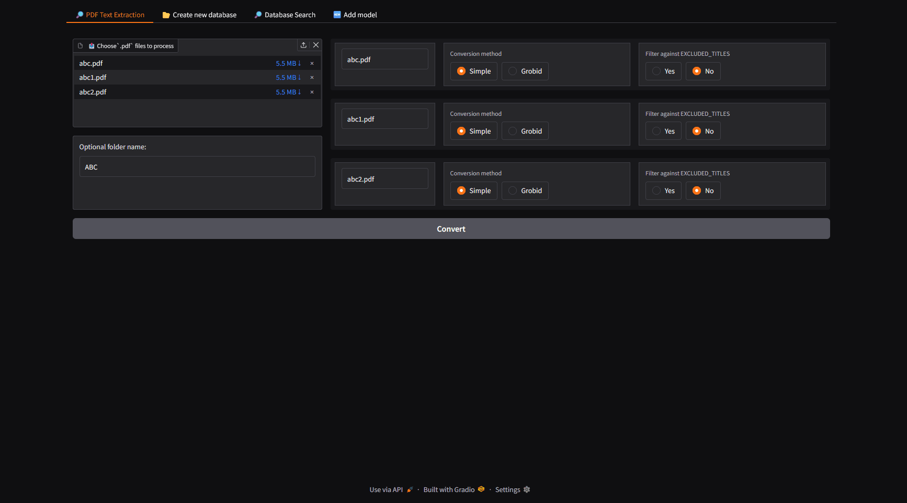

# 📚 Modular Text Retrieval System with Vector Databases

## 🔍 Overview

This modular and extensible system allows you to build and store text embeddings across multiple vector databases, then perform flexible search using a variety of retrieval strategies — from native database queries to model-based semantic matching. It supports processing of raw textual data (e.g., PDFs), segmentation, embedding generation via transformer models, and storage in formats suited for experimentation, evaluation, and long-term reuse.

The project was built to explore and compare different approaches to embedding-based retrieval, and serves as a realistic prototype of a Retrieval-Augmented Generation (RAG) backend.

> ✅ Supports both **database-native search** and **standalone model-based retrieval** using vector similarity calculations (e.g., *cosine similarity*) with embeddings from `SentenceTransformers` or `FlagEmbedding` — fully decoupled from any storage engine.

---



---
## 🎯 Key Features

- **Multi-database support**:
  - `ChromaDB`, `LanceDB` vector storage backends and `SQLite` (used primarily for experimental purposes and testing).
- **Embedding types**:
  - Dense, Sparse, and ColBERT-style embeddings supported.
- **Model flexibility**:
  - Works with `SentenceTransformers` and `FlagEmbedding` models.
- **Precision control**:
  - Embedding precision configurable (`FP16` / `FP32`).
- **Advanced text segmentation**:
  - Token/character-based splitting with overlapping window control.
  - Optional preservation of full sentences, with configurable handling of chunk size limits (can allow or forbid exceeding the limit).
  - Supports token counting based on both TikToken and the current model’s tokenizer.
- **Flexible retrieval**:
  - Search using database-native logic or model-only inference logic (vector similarity search without database).
- **Hugging Face model compatibility**:
  - Models can be downloaded directly from the Hugging Face Hub.
  - The system automatically evaluates model compatibility and selects the appropriate embedding types and libraries (e.g., SentenceTransformers or FlagEmbedding).
- **Test coverage**:
  - End-to-end tests validating embedding generation, storage, retrieval, and search.

---

## 🧱 Architecture

Modular Python codebase structured as:

```
src/
├── pdf_to_txt/         # PDF parsing and text extraction utilities
├── text_retrieval/     # Embedding generation, vector storage, retrieval logic
├── ui/                 # GUI-based interface (Gradio)
└── config.py           # Centralized configuration
```

Includes:
- `VectorDatabaseInfo`: Base class for all database strategies.
- Enum-driven architecture for embedding types, segmentation, precision, and model libraries.
- Factory pattern for dynamic search method selection.

---

## 🧪 Testing

Comes with a `pytest` test suite that:

- Runs all combinations of database types, embedding types, and libraries.
- Verifies that:
  - Embeddings are stored and retrieved correctly.
  - Text chunks are preserved exactly.
  - Vector search returns valid top-k results.
  - Transformer search produces consistent ranking.

---

## 🧠 Purpose

This project was created as a technical experiment to deeply understand:

- Differences in vector database implementations.
- Effects of embedding precision and segmentation methods.
- Hybrid search and sparse embedding usage.
- Test different retrieval methods

---

## 🚀 Ideal Use Cases

- As a base for **custom RAG applications**.
- For evaluating embedding models and indexing strategies.

---

## 🔧 Technologies Used

- Python 3.12
- NumPy, PyArrow, SQLite, pandas, tqdm
- SentenceTransformers, FlagEmbedding (BGE / BAAI models)
- ChromaDB, LanceDB
- Pytest
